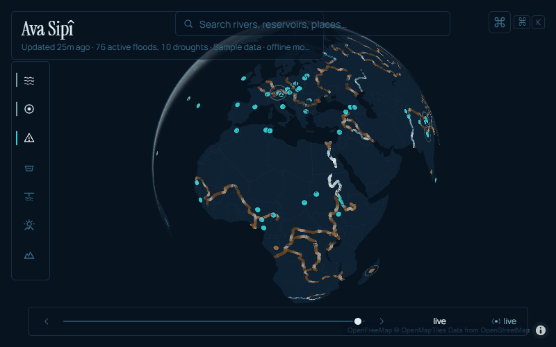
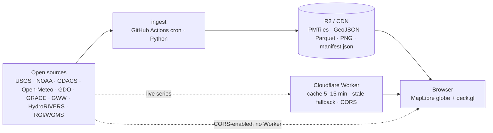

<p align="center">
  
</p>
<h1 align="center">Ava Sipî</h1>
<p align="center"><em>the living map of Earth's water</em></p>

**Ava Sipî** is a live map of Earth's water: rivers flowing at their real rate, floods and droughts as they happen, groundwater and glaciers over two decades.

<p align="center">
  
  <br /><sub>15 s · regenerate with <code>node apps/web/scripts/capture.mjs && python apps/web/scripts/make_gif.py</code> (MP4: see docs/DEVIATIONS.md)</sub>
</p>

## Try it

Run it yourself in three lines below. No API keys needed. To put your own instance online
(Cloudflare Pages + R2, free tier, no domain required) follow [`docs/DEPLOY.md`](docs/DEPLOY.md).

## Quickstart

```bash
git clone https://github.com/deeppaz/ava-sipi && cd ava-sipi
pnpm i
pnpm dev
```

That is a working globe with real (sample) data from `data/samples`. Point `VITE_MANIFEST_URL` at a
published manifest to go live; add keys later to refresh faster (`.env.example`).

## Layers

| Layer | Source | Refresh | Licence |
|---|---|---|---|
| rivers — network + today's flow ratio | HydroRIVERS · Open-Meteo Flood (GloFAS) | yearly · daily | HydroSHEDS · CC BY 4.0 |
| gauges — live discharge, percentile, flood category | USGS Water Data API · NOAA NWPS | 15 min | public domain |
| events — floods, droughts, cyclones | GDACS | 15 min | attribution |
| reservoirs — surface-area fill proxy, 3-year series | Global Water Watch · GRanD | weekly | CC BY 4.0 |
| groundwater — GRACE water-storage anomaly since 2002 | NASA JPL Mascons (GRACE-DA percentile fallback) | monthly | NASA open |
| drought — Combined Drought Indicator | Copernicus Global Drought Observatory | 10-daily | Copernicus open |
| glaciers — outlines + regional mass balance | RGI 7.0 · WGMS | yearly | CC BY 4.0 · open |
| snow, tides | MODIS · NOAA CO-OPS | v1.5 | — |

Details, endpoints and known issues: [`docs/DATA_SOURCES.md`](docs/DATA_SOURCES.md) and each
`ingest/pipelines/<source>/README.md`.

## Add a layer

1. Contract in `packages/schema`, `pnpm schema:export`.
2. Manifest in `packages/layers/src/<id>.ts` (colour token, legend, LOD, time support, attribution).
3. `ingest/pipelines/<source>/run.py` → `run(config) -> LayerManifest`, fixture + test, README.
4. Renderer in `apps/web/src/layers/` (deck builder or MapLibre-native) and a panel detail.
5. Strings in `apps/web/src/i18n/{en,tr,ku}.json`, a row in `docs/DATA_SOURCES.md`, a changeset.

Full guide: [`docs/ADDING_A_LAYER.md`](docs/ADDING_A_LAYER.md).

## Stories

Guided, keyboard-driven, shareable (`?story=<id>&step=<n>`):
**Euphrates and Tigris** · **The Aral Sea** · **The Colorado** · **Alpine glaciers**.
Content notes and sources: [`docs/STORIES.md`](docs/STORIES.md).

## Architecture



Static-first: no server, no database, deploy anywhere static. More in
[`docs/ARCHITECTURE.md`](docs/ARCHITECTURE.md); decisions that differ from the master spec are
logged in [`docs/DEVIATIONS.md`](docs/DEVIATIONS.md).

## Development

```bash
pnpm lint            # biome
pnpm typecheck       # tsc across packages
pnpm test            # vitest (web, worker, schema, layers)
pnpm build && pnpm budget   # vite build + 450 KB gzip initial-JS budget
pnpm e2e             # playwright smoke + visual regression (chromium)
cd ingest && uv sync && uv run pytest    # pipelines on fixtures
uv run python cli.py samples             # rebuild data/samples from live sources
```

Languages: English, Türkçe, Kurmancî (`localStorage` + browser language, never the URL).
Accessibility: every control is keyboard-reachable, `prefers-reduced-motion` freezes the flow and
pulses without losing information, critical states are encoded by width and pattern as well as colour.

## Roadmap

- **v1.5** — snow cover, tide stations.
- **v2** — Türkiye (DSİ/TÜİK public reports) and other national gauge networks (Canada, Australia, EU WISE), embed widget polish, `ava-sipi-mcp` (ask "how is the Euphrates today?" from Claude Code).

## Attributions & licence

Data providers are listed in [`ATTRIBUTIONS.md`](ATTRIBUTIONS.md) — keep them when you fork or embed.
Code is MIT ([`LICENSE`](LICENSE)).

Topics: `hydrology` `water` `maplibre` `deck-gl` `open-data` `climate` `earth-observation` `globe` `data-visualization`
